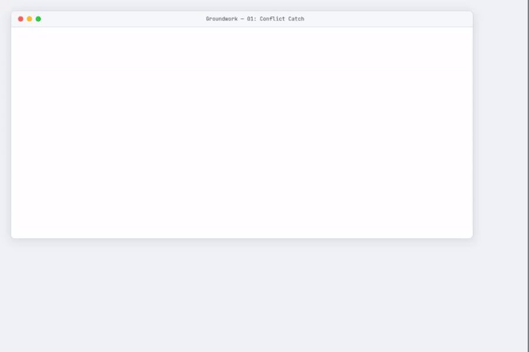
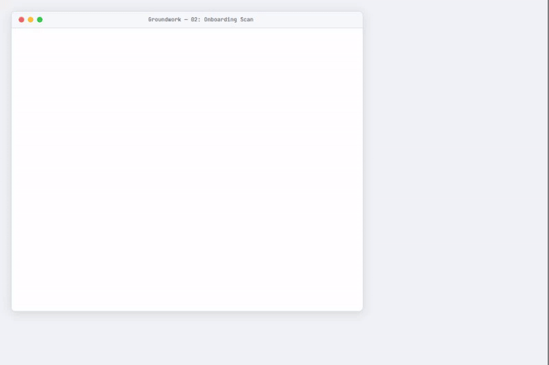
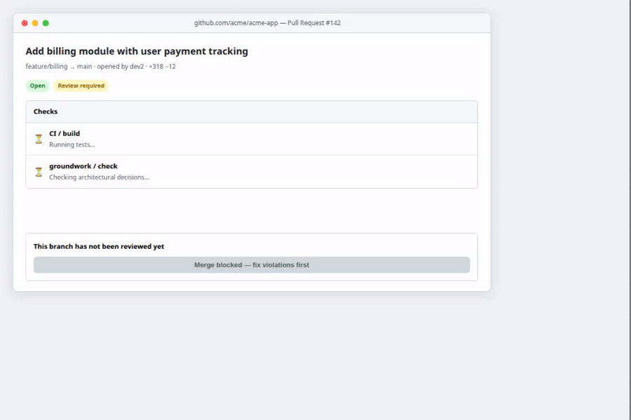
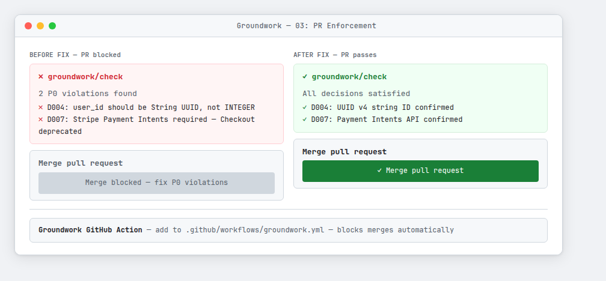
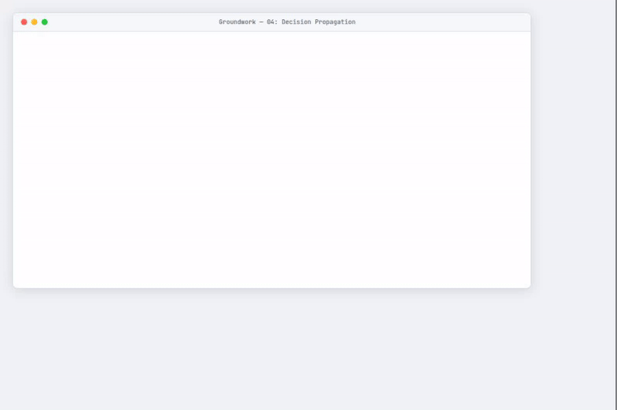
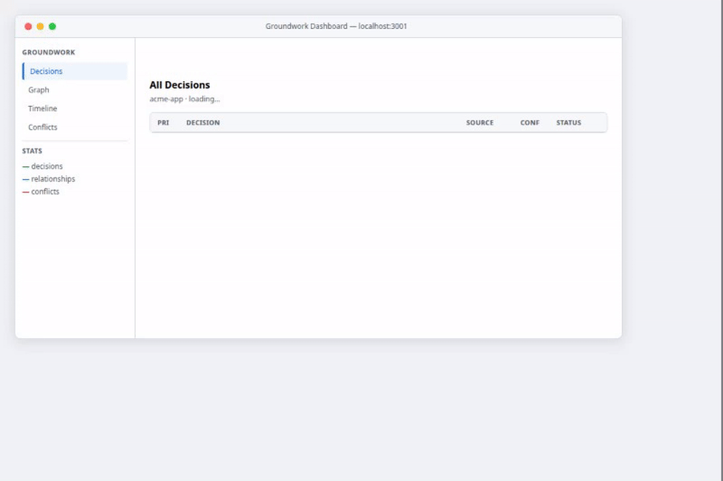
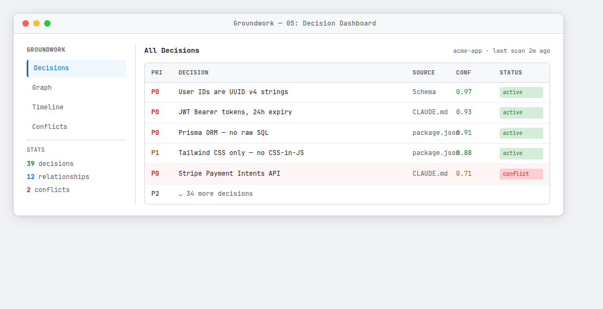
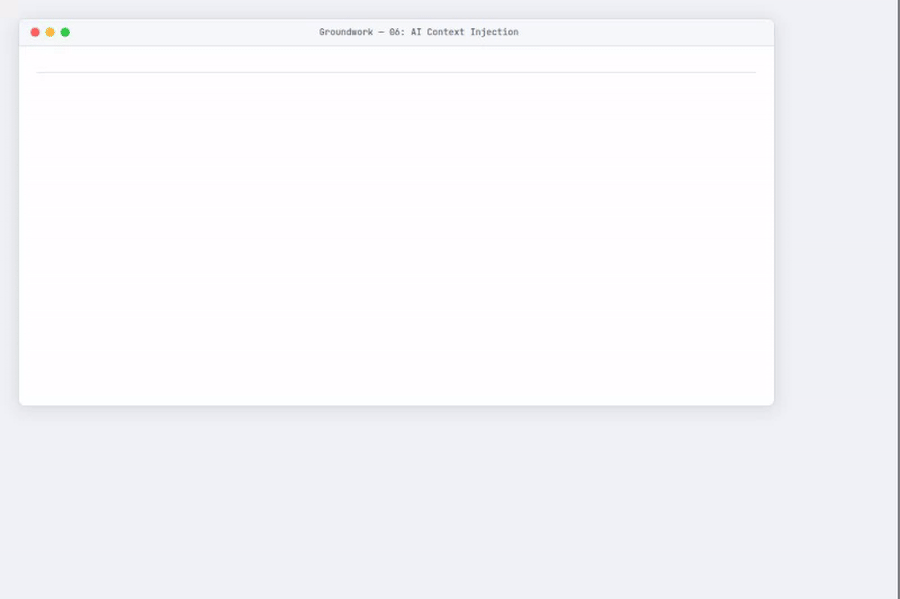
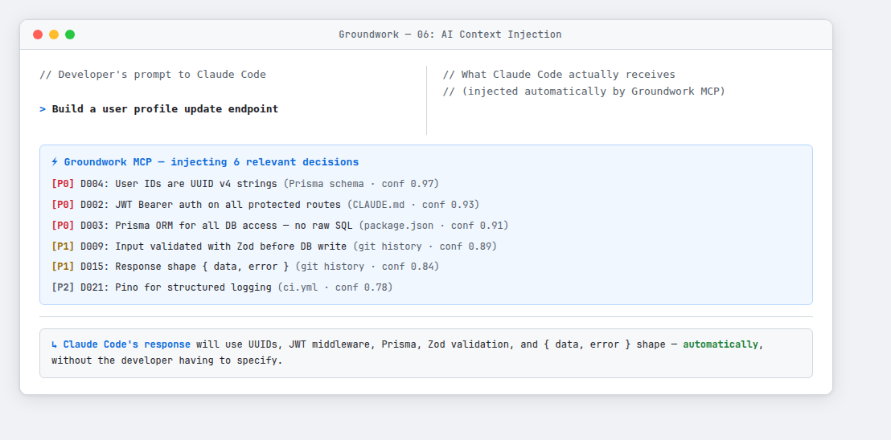

# Groundwork

**The decision layer that makes AI development actually work at team scale.**

[](https://opensource.org/licenses/MIT)

---

## The Problem

AI coding tools like Claude Code, Cursor, and GitHub Copilot have made individual developers incredibly productive. But when teams use them, chaos emerges:

- **No shared memory** — each developer's AI has a completely isolated view of the project
- **Architectural drift** — AI tools make locally sensible but globally inconsistent decisions
- **Lost decisions** — choices made in AI sessions disappear when the session ends
- **Review bottlenecks** — code reviews become the constraint as teams check for consistency

At team scales of 15+ developers, AI productivity gains compress to just 31% because coordination overhead dominates.

## The Solution

Groundwork sits underneath every AI coding tool your team uses. It:

1. **Captures** architectural decisions automatically from AI coding sessions
2. **Propagates** those decisions to every developer's AI in real-time
3. **Enforces** decisions by blocking PRs that violate them

---

## Demos

> All 6 demos below are animated recordings of the actual tool.

<!-- ─── SCENARIO 1 ──────────────────────────────────────────────────────── -->
<details>
<summary><strong>🚨 Scenario 1 — Conflict Catch:</strong> stops the wrong line before it's committed</summary>
<br/>

Dev 1 commits to UUID string IDs. Dev 2 starts typing `INTEGER` in a different session 20 minutes later. Groundwork fires a conflict box mid-keystroke and suggests the correct type — before a single wrong line is committed.



**Screenshot (light mode):**


</details>

<!-- ─── SCENARIO 2 ──────────────────────────────────────────────────────── -->
<details>
<summary><strong>📦 Scenario 2 — Onboarding Scan:</strong> 39 decisions loaded in 38 seconds</summary>
<br/>

Run `groundwork init` in any existing project. It reads CLAUDE.md, package.json, Prisma schemas, git history, and CI config — and loads your team's decisions automatically from day one. No cold start.



**Screenshot (light mode):**


</details>

<!-- ─── SCENARIO 3 ──────────────────────────────────────────────────────── -->
<details>
<summary><strong>🔒 Scenario 3 — PR Enforcement:</strong> P0 violations block the merge button</summary>
<br/>

The GitHub Action checks every PR against the decision graph. P0 (critical) violations block the merge button entirely. Fix the violation, push, and the check re-runs — merge button activates.



**Screenshots (before and after fix):**



</details>

<!-- ─── SCENARIO 4 ──────────────────────────────────────────────────────── -->
<details>
<summary><strong>🔄 Scenario 4 — Propagation:</strong> Dev 2's AI already knows what Dev 1 decided</summary>
<br/>

Dev 1 ends a Claude Code session. Groundwork extracts 3 new decisions (WebSocket, Redis, BullMQ) and propagates them to the team graph. Dev 2 starts a new session 30 minutes later and asks a completely unrelated question — their AI responds already citing the correct approaches by decision ID.



**Screenshot (light mode):**


*Dev 1 decided. Dev 2's AI already knew. Zero communication required.*

</details>

<!-- ─── SCENARIO 5 ──────────────────────────────────────────────────────── -->
<details>
<summary><strong>📊 Scenario 5 — Decision Dashboard:</strong> live graph, timeline, and conflict view</summary>
<br/>

The web dashboard shows all decisions, their relationships, a chronological timeline, and active conflicts. Navigate between Decisions, Graph, Timeline, and Conflicts views. Runs on `localhost:3001` and shares a URL you can link teammates to with `?tab=graph`.



**Screenshot (light mode):**



</details>

<!-- ─── SCENARIO 6 ──────────────────────────────────────────────────────── -->
<details>
<summary><strong>⚡ Scenario 6 — Context Injection:</strong> what your AI actually sees</summary>
<br/>

When you type a prompt into Claude Code or Cursor, Groundwork's MCP layer intercepts it and injects the 4–8 most relevant decisions from your team's graph. A 6-word prompt like "build a user profile endpoint" becomes a fully context-aware request — without the developer having to know or specify any of the constraints.



**Screenshot (light mode):**



</details>

---

## Quick Start

> **Current status**: Full local workflow works today. Clone the repo, build, and run.
> npm package publishing is in progress (see [Hosting & Deployment](#hosting--deployment) below).

```bash
# Clone and install
git clone https://github.com/vupatel08/Daily-Leetcode
cd Daily-Leetcode
npm ci

# Build everything
npm run build

# Run the API + dashboard
cd packages/api && npm start
# Dashboard: http://localhost:3001

# Initialize Groundwork in your project
cd your-project
node /path/to/groundwork/packages/cli/dist/cli.js init
```

See [QUICKSTART.md](./QUICKSTART.md) for the full step-by-step guide.

---

## How It Works

```
LAYER 5: Product Requirements (Jira, Linear)
           ↓
LAYER 4: Specifications (OpenSpec, GitHub Spec Kit)   ← SDD tools
           ↓
LAYER 3: Decision Graph (Groundwork)                  ← THIS GAP
           ↓
LAYER 2: AI Coding Tools (Claude Code, Cursor, etc.)
           ↓
LAYER 1: Generated Code
```

---

## Core Features

| Feature | Description |
|---------|-------------|
| **Auto-extraction** | Reads CLAUDE.md, package.json, Prisma schemas, git history, CI config |
| **Real-time propagation** | Decisions reach other AI tools in < 60 seconds |
| **Conflict detection** | Fires before wrong code is written, not after |
| **PR enforcement** | GitHub Action blocks merges on P0 violations |
| **Decision Graph** | Living network with CONSTRAINS / DEPENDS_ON / SUPERSEDES / CONFLICTS_WITH edges |
| **Dashboard** | Web UI for decisions, graph, timeline, conflicts |
| **MCP server** | Works with Claude Code, Cursor, and all MCP-compatible tools |

---

## Hosting & Deployment

Groundwork has three deployment modes:

### Mode 1 — Local (works today, no hosting needed)

Every developer runs the MCP server on their own machine. Decisions are stored in a local JSON file. No database, no cloud. Perfect for solo devs and trying it out.

```bash
# MCP server runs locally, decisions stored at ~/.groundwork/decisions.json
groundwork init && groundwork connect
```

**What works**: all extraction, injection, conflict detection, CLI, dashboard.
**What doesn't**: sharing decisions across a team (that requires Mode 2).

---

### Mode 2 — Self-hosted team server

Deploy the `packages/api` Express server somewhere with a Postgres database. All team members point their MCP servers at the same API endpoint.

**Easiest options (15-minute deploy):**

| Platform | Cost | Notes |
|----------|------|-------|
| [Railway.app](https://railway.app) | Free tier / ~$5/mo | Click-deploy from GitHub, add Postgres plugin |
| [Render.com](https://render.com) | Free tier | Free Postgres for 90 days, then $7/mo |
| [Fly.io](https://fly.io) | ~$3/mo | `fly launch` from the `packages/api` directory |
| Docker Compose | Your infra cost | See `database/schema.sql` for Postgres setup |

**Deploy to Railway** (fastest path):
```bash
# 1. Push this repo to GitHub (already done)
# 2. Go to railway.app → New Project → Deploy from GitHub
# 3. Select the repo → set root to packages/api
# 4. Add a Postgres database plugin
# 5. Set env vars: DATABASE_URL (from Railway), PORT=3001
# 6. Done — team API is live
```

Then each developer sets:
```bash
export GROUNDWORK_API_URL=https://your-app.railway.app
groundwork connect
```

---

### Mode 3 — Cloud SaaS (V2 roadmap)

A hosted version of Groundwork where you sign up, connect your repo, and zero infrastructure is needed. This is the V2 direction — not built yet.

---

## Roadmap

### V1 — MVP (Implemented ✅)

- [x] MCP server (Claude Code + Cursor integration)
- [x] Decision extraction: CLAUDE.md, package.json, Prisma, git history, CI config
- [x] Extraction pipeline with cross-source deduplication
- [x] Decision store: local JSON (zero-dep) or Postgres + pgvector
- [x] Priority-aware, relevance-ranked context injection
- [x] Conflict detection (rule-based, fires before code is written)
- [x] Decision Graph with typed relationships (CONSTRAINS / DEPENDS_ON / SUPERSEDES / CONFLICTS_WITH)
- [x] RelationshipInferrer (automatic edge derivation)
- [x] Session extraction (heuristic + optional LLM)
- [x] GitHub Action PR enforcement (blocks P0 violations)
- [x] REST API + React dashboard (decisions, graph, timeline, conflicts, deep-linking)
- [x] Slack notifications
- [x] CLI (`init`, `scan`, `status`, `connect`)
- [x] 37 passing tests

### V2 — Months 4-6

- [ ] npm package publishing (`npm install -g @groundwork/cli`)
- [ ] Hosted cloud API (no self-hosting required)
- [ ] Windsurf, Codex, Copilot support
- [ ] Graph DB upgrade
- [ ] Coverage heatmap
- [ ] Linear/Jira integration
- [ ] Meeting transcript extraction

### V3 — Months 7-12

- [ ] Fine-tuned extraction model
- [ ] On-premises deployment
- [ ] SOC 2 Type II
- [ ] SAML/SSO
- [ ] OpenSpec deep integration

---

## Architecture

```
packages/
  shared/         # Shared TypeScript types
  mcp-server/     # Core engine + MCP server (extraction, injection,
                  #   conflict detection, PR checker, stores, notifier)
  cli/            # groundwork CLI (init, scan, status, connect)
  api/            # Express API + React dashboard
  github-action/  # PR enforcement GitHub Action
database/         # Postgres schema (pgvector)
demos/            # Animated demo recordings (6 scenarios)
docs/             # Product, architecture, SDD integration docs
```

---

## Documentation

- [Quickstart](./QUICKSTART.md) — run Groundwork in 5 minutes
- [Technical Architecture](./docs/ARCHITECTURE.md) — system design
- [Decision Graph Design](./docs/DECISION_GRAPH.md) — core data structure
- [Integration Guide](./docs/INTEGRATIONS.md) — connecting AI tools
- [Full Product Document](./docs/PRODUCT.md) — complete vision
- [SDD Integration](./docs/SDD_INTEGRATION.md) — how Groundwork fits with SDD tools

---

## Contributing

See [CONTRIBUTING.md](./CONTRIBUTING.md) for guidelines.

## License

MIT — see [LICENSE](./LICENSE).

---

## Privacy & Security

**Core principle: raw code never leaves your machine.**

- MCP server runs locally on each developer's computer
- Extraction pipeline runs locally
- Only structured decisions (JSON metadata) reach the team store
- Source code, secrets, and environment variables are never transmitted
- Open source — fully auditable

---

*The SDD movement solved "what to build." Groundwork solves "what was decided during building."*

**Groundwork** — The architectural decisions your AI won't forget.
