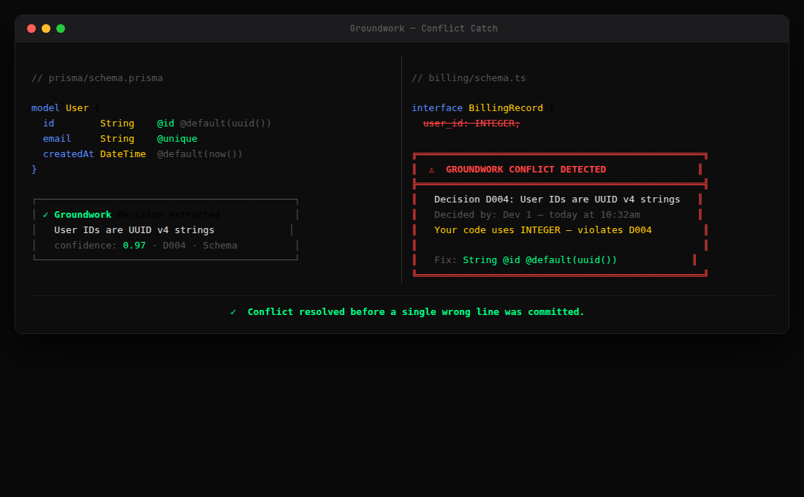
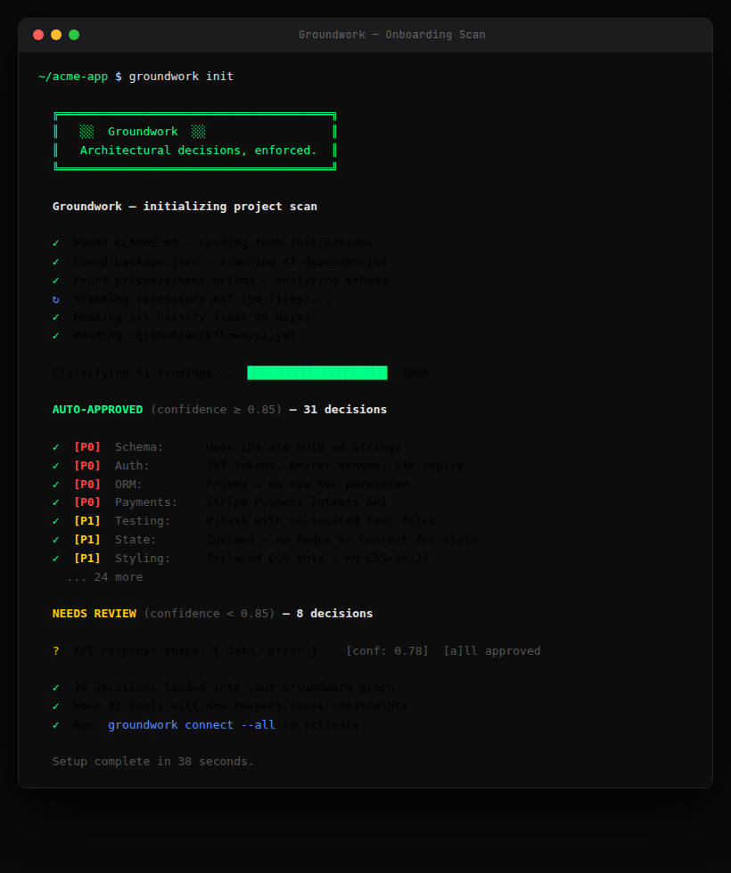
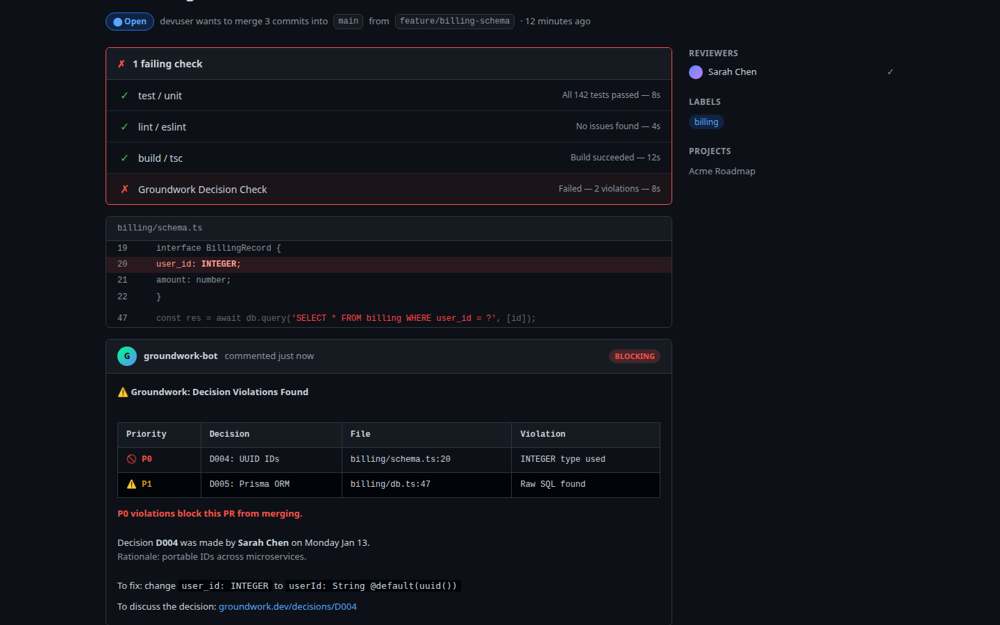
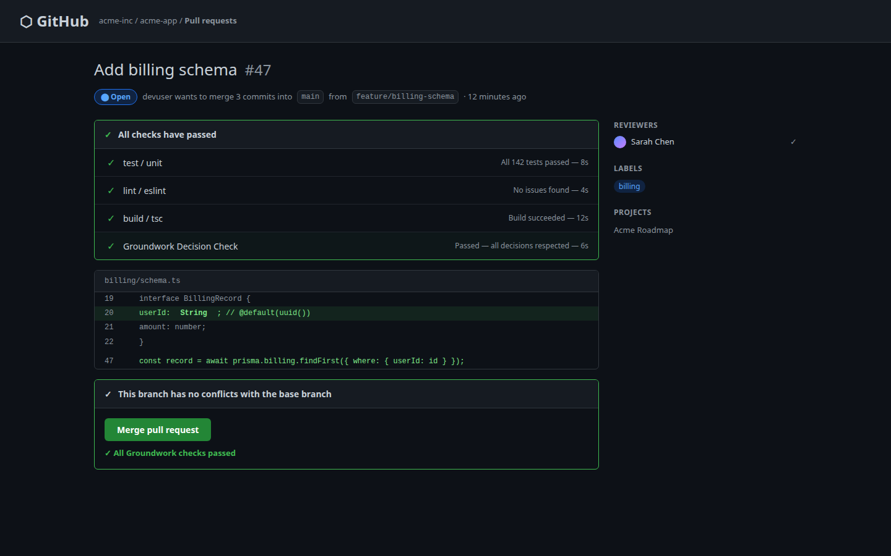
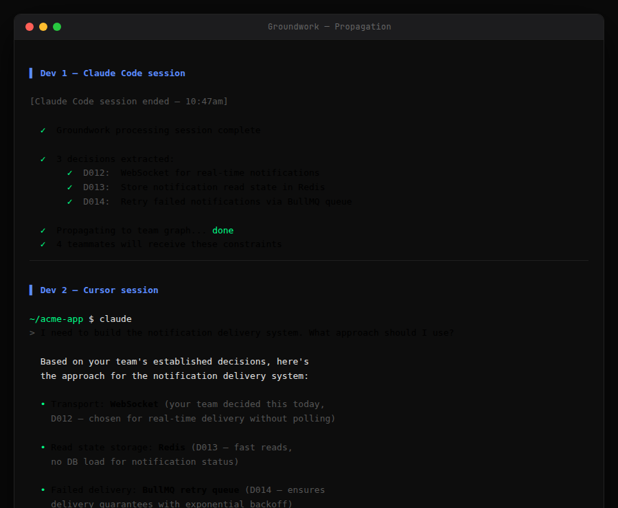

# Groundwork

**The decision layer that makes AI development actually work at team scale.**

[](https://opensource.org/licenses/MIT)

## The Problem

AI coding tools like Claude Code, Cursor, and GitHub Copilot have made individual developers incredibly productive. But when teams use them, chaos emerges:

- **No shared memory**: Each developer's AI has a completely isolated view of the project
- **Architectural drift**: AI tools make locally sensible but globally inconsistent decisions
- **Lost decisions**: Choices made in AI sessions disappear when the session ends
- **Review bottlenecks**: Code reviews become the new constraint as teams check for consistency

Research shows that at team scales of 15+ developers, AI tool productivity gains compress to just 31% because coordination overhead dominates.

## The Solution

Groundwork sits underneath every AI coding tool your team uses. It:

1. **Captures** architectural decisions automatically from AI coding sessions
2. **Propagates** those decisions to every developer's AI in real-time
3. **Enforces** decisions by blocking PRs that violate them

---

## How It Works

### Conflict catch — before a single wrong line is committed

Dev 1 commits to UUID IDs. Dev 2 starts typing `INTEGER` in a different session. Groundwork fires mid-keystroke:



### Onboarding scan — 39 decisions loaded in 38 seconds

Run `groundwork init` in any project. It reads CLAUDE.md, package.json, Prisma schemas, git history, and CI config — and loads your team's decisions automatically from day one:



### PR enforcement — P0 violations block merge

The GitHub Action checks every PR against the decision graph. P0 violations block the merge button:



Fix the violation. Check re-runs. Merge button activates:



### Propagation — Dev 2's AI already knows

Dev 1 ends a session. Groundwork extracts 3 new decisions and propagates them. Dev 2 starts a new session immediately and asks a completely unrelated question — their AI responds already citing WebSocket, Redis, and BullMQ by decision ID:



*Dev 1 decided. Dev 2's AI already knew. Zero communication required.*

---

## Core Features

### 🎯 Automatic Decision Extraction
- Scans existing codebase on install (20-40 decisions from day one)
- Extracts decisions from live AI coding sessions
- Processes CLAUDE.md, package.json, database schemas, and more

### 🔄 Real-Time Propagation
- Decisions reach other developers' AI tools in under 60 seconds
- Smart, relevance-ranked injection (only relevant decisions get injected)
- Works with Claude Code, Cursor, Windsurf, and all MCP-compatible tools

### 🚫 Enforcement Layer
- GitHub Action checks every PR against the decision graph
- P0 (critical) violations block merge
- P1 (important) violations warn but don't block
- Detailed explanations of what violated which decision

### 📊 Decision Graph
- Living network of decisions and their relationships
- Priority levels (P0/P1/P2) for smart enforcement
- Conflict detection before code gets written
- CONSTRAINS / DEPENDS_ON / SUPERSEDES / CONFLICTS_WITH edge types

## Quick Start

### Installation

```bash
# Install the Groundwork CLI
npm install -g @groundwork/cli

# Initialize in your project
cd your-project
groundwork init

# Connect to your AI tools (one-time setup)
groundwork connect
```

That's it. Groundwork now runs automatically in the background.

### First Run

On first install, Groundwork scans your existing project and extracts decisions from:
- CLAUDE.md / AGENTS.md files
- package.json dependencies  
- Database schemas
- Architecture documentation
- Recent commit history

Your decision graph is populated immediately—no cold start.

## How It Fits With Spec-Driven Development

Groundwork complements SDD tools like GitHub Spec Kit, OpenSpec, AWS Kiro, and BMAD:

| **SDD Tools** | **Groundwork** |
|---------------|----------------|
| Help you write specs *before* building | Captures decisions *during* building |
| Define what to build | Remembers what was decided |
| Static documents | Living, enforced graph |
| Require manual maintenance | Automatic extraction and updates |

**Together**: SDD defines the plan. Groundwork captures what happened during execution and makes sure every AI on the team knows about it.

## Architecture

```
LAYER 5: Product Requirements (Jira, Linear)
           ↓
LAYER 4: Specifications (OpenSpec, GitHub Spec Kit) ← SDD tools operate here
           ↓
LAYER 3: Decision Graph (Groundwork) ← THIS IS THE GAP WE FILL
           ↓
LAYER 2: AI Coding Tools (Claude Code, Cursor, etc.)
           ↓
LAYER 1: Generated Code
```

## The MVP

The minimum viable product focuses on three extractors:

1. **CLAUDE.md / AGENTS.md reader** - Highest signal existing decisions
2. **package.json scanner** - Every dependency is a decision
3. **Database schema analyzer** - ID formats, naming conventions, patterns

Two AI tool integrations:
- Claude Code
- Cursor

One enforcement mechanism:
- GitHub Action PR blocker

This covers 80% of team decisions with a focused, shippable scope.

## Roadmap

### V1 - MVP (Implemented ✅)
- [x] MCP server exposing 4 tools for Claude Code + Cursor
- [x] Decision extraction: CLAUDE.md, package.json, Prisma schema, git history, CI config
- [x] Extraction pipeline with cross-source dedupe
- [x] Decision store: local JSON (zero-dep) or Postgres + pgvector
- [x] Priority-aware, relevance-ranked injection
- [x] Conflict detection (rule-based, high-precision)
- [x] Relationship graph (CONSTRAINS / DEPENDS_ON / SUPERSEDES / CONFLICTS_WITH)
- [x] Session extraction (heuristic + optional LLM)
- [x] GitHub Action PR enforcement (blocks P0 violations)
- [x] Cloud API + React dashboard (decisions + graph + timeline + conflicts)
- [x] Slack notifications + config system
- [x] 37 passing tests

See [QUICKSTART.md](./QUICKSTART.md) to run it.

### V2 - Months 4-6
- [ ] Windsurf, Codex, Copilot support
- [ ] Graph DB upgrade
- [ ] Coverage heatmap
- [ ] Linear/Jira integration
- [ ] Meeting transcript extraction

### V3 - Months 7-12
- [ ] Fine-tuned extraction model
- [ ] On-premises deployment
- [ ] SOC 2 Type II certification
- [ ] SAML/SSO
- [ ] OpenSpec deep integration

### V4 - Year 2
- [ ] Cross-repo governance
- [ ] Decision impact analysis
- [ ] AI-assisted conflict resolution
- [ ] Custom model fine-tuning

## Pricing

- **Free**: 1 developer, 1 project, 50 decisions, no enforcement
- **Team ($299/mo)**: Up to 15 developers, unlimited projects, full enforcement
- **Growth ($799/mo)**: Up to 50 developers, integrations, coverage heatmap
- **Enterprise (from $50K/yr)**: Unlimited, on-premises, SSO, dedicated support

## Privacy & Security

**Core principle: Raw code never leaves your machine.**

- MCP server runs locally on developer's computer
- Extraction pipeline runs locally
- Only structured decisions (JSON) reach Groundwork cloud
- Source code, secrets, and environment variables never transmitted
- Open source MCP server (Apache 2.0) - fully auditable
- On-premises deployment available for Enterprise

## Repository Layout

```
packages/
  shared/         # Shared TypeScript types
  mcp-server/     # Core engine + MCP server (extraction, injection,
                  #   conflict detection, PR checker, stores, notifier)
  cli/            # groundwork CLI (init, scan, status, connect)
  api/            # Express API + React dashboard
  github-action/  # PR enforcement GitHub Action
  landing/        # Marketing landing page
database/         # Postgres schema (pgvector)
demos/            # Demo recording scripts (4 scenarios)
example/          # Sample project used for demos/tests
docs/             # Product, architecture, business, SDD integration
```

## Documentation

- [Quickstart](./QUICKSTART.md) - Run Groundwork in minutes
- [Development Setup](./DEVELOPMENT.md) - Local dev environment
- [Full Product Document](./docs/PRODUCT.md) - Complete vision and architecture
- [Technical Architecture](./docs/ARCHITECTURE.md) - System design details
- [Decision Graph Design](./docs/DECISION_GRAPH.md) - Core data structure
- [Integration Guide](./docs/INTEGRATIONS.md) - How to connect AI tools
- [MVP Specification](./docs/MVP.md) - What gets built first
- [SDD Integration](./docs/SDD_INTEGRATION.md) - How Groundwork fits with SDD tools

## Contributing

We welcome contributions! See [CONTRIBUTING.md](./CONTRIBUTING.md) for guidelines.

## License

MIT License - see [LICENSE](./LICENSE) for details.

## Market Context

- 85% of developers now use AI coding tools regularly
- 87% of Fortune 500 companies use AI coding platforms
- 50%+ of Fortune 1000 have active SDD pipelines (April 2026)
- 110,000+ AI-introduced issues found in production repos
- Teams hit "three-month wall" where AI-generated codebases become unmaintainable

**The SDD movement solved the "what to build" problem. Groundwork solves the "what was decided during building" problem.**

---

**Groundwork** - The architectural decisions your AI won't forget.

Website: [groundwork.dev](https://groundwork.dev) | Email: hello@groundwork.dev


AI coding tools like Claude Code, Cursor, and GitHub Copilot have made individual developers incredibly productive. But when teams use them, chaos emerges:

- **No shared memory**: Each developer's AI has a completely isolated view of the project
- **Architectural drift**: AI tools make locally sensible but globally inconsistent decisions
- **Lost decisions**: Choices made in AI sessions disappear when the session ends
- **Review bottlenecks**: Code reviews become the new constraint as teams check for consistency

Research shows that at team scales of 15+ developers, AI tool productivity gains compress to just 31% because coordination overhead dominates.

## The Solution

Groundwork sits underneath every AI coding tool your team uses. It:

1. **Captures** architectural decisions automatically from AI coding sessions
2. **Propagates** those decisions to every developer's AI in real-time
3. **Enforces** decisions by blocking PRs that violate them

### How It Works

```
Developer 1's AI session → Makes decision about UUID user IDs
                          ↓
                    Groundwork extracts decision
                          ↓
                    Stores in decision graph
                          ↓
Developer 2's AI session → Automatically knows about UUID decision
                          ↓
           Suggests integer IDs (conflicts!)
                          ↓
              Groundwork blocks in real-time
```

## Core Features

### 🎯 Automatic Decision Extraction
- Scans existing codebase on install (20-40 decisions from day one)
- Extracts decisions from live AI coding sessions
- Processes CLAUDE.md, package.json, database schemas, and more

### 🔄 Real-Time Propagation
- Decisions reach other developers' AI tools in under 60 seconds
- Smart, relevance-ranked injection (only relevant decisions get injected)
- Works with Claude Code, Cursor, Windsurf, and all MCP-compatible tools

### 🚫 Enforcement Layer
- GitHub Action checks every PR against the decision graph
- P0 (critical) violations block merge
- P1 (important) violations warn but don't block
- Detailed explanations of what violated which decision

### 📊 Decision Graph
- Living network of decisions and their relationships
- Priority levels (P0/P1/P2) for smart enforcement
- Conflict detection before code gets written
- Coverage heatmap shows which modules have decision coverage

## Quick Start

### Installation

```bash
# Install the Groundwork CLI
npm install -g @groundwork/cli

# Initialize in your project
cd your-project
groundwork init

# Connect to your AI tools (one-time setup)
groundwork connect
```

That's it. Groundwork now runs automatically in the background.

### First Run

On first install, Groundwork scans your existing project and extracts decisions from:
- CLAUDE.md / AGENTS.md files
- package.json dependencies  
- Database schemas
- Architecture documentation
- Recent commit history

Your decision graph is populated immediately—no cold start.

## How It Fits With Spec-Driven Development

Groundwork complements SDD tools like GitHub Spec Kit, OpenSpec, AWS Kiro, and BMAD:

| **SDD Tools** | **Groundwork** |
|---------------|----------------|
| Help you write specs *before* building | Captures decisions *during* building |
| Define what to build | Remembers what was decided |
| Static documents | Living, enforced graph |
| Require manual maintenance | Automatic extraction and updates |

**Together**: SDD defines the plan. Groundwork captures what happened during execution and makes sure every AI on the team knows about it.

## Architecture

```
LAYER 5: Product Requirements (Jira, Linear)
           ↓
LAYER 4: Specifications (OpenSpec, GitHub Spec Kit) ← SDD tools operate here
           ↓
LAYER 3: Decision Graph (Groundwork) ← THIS IS THE GAP WE FILL
           ↓
LAYER 2: AI Coding Tools (Claude Code, Cursor, etc.)
           ↓
LAYER 1: Generated Code
```

## The MVP

The minimum viable product focuses on three extractors:

1. **CLAUDE.md / AGENTS.md reader** - Highest signal existing decisions
2. **package.json scanner** - Every dependency is a decision
3. **Database schema analyzer** - ID formats, naming conventions, patterns

Two AI tool integrations:
- Claude Code
- Cursor

One enforcement mechanism:
- GitHub Action PR blocker

This covers 80% of team decisions with a focused, shippable scope.

## Roadmap

### V1 - MVP (Implemented ✅)
- [x] MCP server exposing 4 tools for Claude Code + Cursor
- [x] Decision extraction: CLAUDE.md, package.json, Prisma schema, git history, CI config
- [x] Extraction pipeline with cross-source dedupe
- [x] Decision store: local JSON (zero-dep) or Postgres + pgvector
- [x] Priority-aware, relevance-ranked injection
- [x] Conflict detection (rule-based, high-precision)
- [x] Relationship graph (CONSTRAINS / DEPENDS_ON / SUPERSEDES / CONFLICTS_WITH)
- [x] Session extraction (heuristic + optional LLM)
- [x] GitHub Action PR enforcement (blocks P0 violations)
- [x] Cloud API + React dashboard (decisions + graph + timeline + conflicts)
- [x] Slack notifications + config system
- [x] 37 passing tests

See [QUICKSTART.md](./QUICKSTART.md) to run it.

### V2 - Months 4-6
- [ ] Windsurf, Codex, Copilot support
- [ ] Graph DB upgrade
- [ ] Coverage heatmap
- [ ] Linear/Jira integration
- [ ] Meeting transcript extraction

### V3 - Months 7-12
- [ ] Fine-tuned extraction model
- [ ] On-premises deployment
- [ ] SOC 2 Type II certification
- [ ] SAML/SSO
- [ ] OpenSpec deep integration

### V4 - Year 2
- [ ] Cross-repo governance
- [ ] Decision impact analysis
- [ ] AI-assisted conflict resolution
- [ ] Custom model fine-tuning

## Pricing

- **Free**: 1 developer, 1 project, 50 decisions, no enforcement
- **Team ($299/mo)**: Up to 15 developers, unlimited projects, full enforcement
- **Growth ($799/mo)**: Up to 50 developers, integrations, coverage heatmap
- **Enterprise (from $50K/yr)**: Unlimited, on-premises, SSO, dedicated support

## Privacy & Security

**Core principle: Raw code never leaves your machine.**

- MCP server runs locally on developer's computer
- Extraction pipeline runs locally
- Only structured decisions (JSON) reach Groundwork cloud
- Source code, secrets, and environment variables never transmitted
- Open source MCP server (Apache 2.0) - fully auditable
- On-premises deployment available for Enterprise

## Repository Layout

```
packages/
  shared/         # Shared TypeScript types
  mcp-server/     # Core engine + MCP server (extraction, injection,
                  #   conflict detection, PR checker, stores, notifier)
  cli/            # groundwork CLI (init, scan, status, connect)
  api/            # Express API + React dashboard
  github-action/  # PR enforcement GitHub Action
  landing/        # Marketing landing page
database/         # Postgres schema (pgvector)
example/          # Sample project used for demos/tests
docs/             # Product, architecture, business, SDD integration
```

## Documentation

- [Quickstart](./QUICKSTART.md) - Run Groundwork in minutes
- [Development Setup](./DEVELOPMENT.md) - Local dev environment
- [Full Product Document](./docs/PRODUCT.md) - Complete vision and architecture
- [Technical Architecture](./docs/ARCHITECTURE.md) - System design details
- [Decision Graph Design](./docs/DECISION_GRAPH.md) - Core data structure
- [Integration Guide](./docs/INTEGRATIONS.md) - How to connect AI tools
- [MVP Specification](./docs/MVP.md) - What gets built first
- [SDD Integration](./docs/SDD_INTEGRATION.md) - How Groundwork fits with SDD tools

## Contributing

We welcome contributions! See [CONTRIBUTING.md](./CONTRIBUTING.md) for guidelines.

## License

MIT License - see [LICENSE](./LICENSE) for details.

## Market Context

- 85% of developers now use AI coding tools regularly
- 87% of Fortune 500 companies use AI coding platforms
- 50%+ of Fortune 1000 have active SDD pipelines (April 2026)
- 110,000+ AI-introduced issues found in production repos
- Teams hit "three-month wall" where AI-generated codebases become unmaintainable

**The SDD movement solved the "what to build" problem. Groundwork solves the "what was decided during building" problem.**

---

**Groundwork** - The architectural decisions your AI won't forget.

Website: [groundwork.dev](https://groundwork.dev) | Email: hello@groundwork.dev
